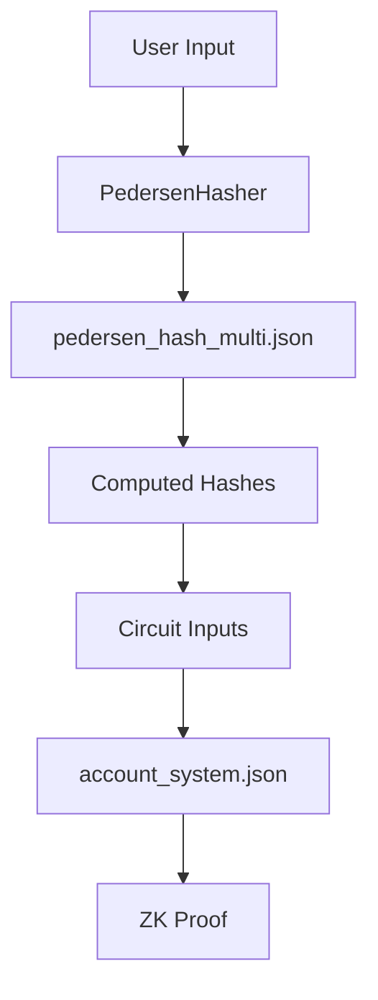

# Frontend Circuits Directory

## What Are These JSON Files?

These are **compiled Noir circuits** that have been:
1. Written in Noir language (`.nr` files)
2. Compiled using `nargo compile` 
3. Copied here from `circuits/*/target/*.json`

Each JSON file contains:
- **bytecode**: The compiled circuit for the proving backend
- **abi**: The circuit's input/output interface
- **debug_symbols**: For debugging (not used in production)

## Current Files

### `account_system.json` ✅
- **Source**: `circuits/account_system/target/account_system.json`
- **Purpose**: Main private transfer circuit using account abstraction
- **Status**: Working correctly

### `commitment_system.json` ✅
- **Source**: `circuits/commitment_system/target/commitment_system.json`
- **Purpose**: UTXO-style private transfers (like Zcash)
- **Status**: Working correctly

### `pedersen_hash_multi.json` ✅
- **Source**: `circuits/pedersen_hash_multi/target/pedersen_hash_multi.json`
- **Purpose**: Helper circuit to compute Pedersen hashes for input preparation
- **Status**: Working correctly

### `pedersen_hash.json` ❌
- **Source**: Was from a circuit that no longer exists
- **Purpose**: Was an attempt to fix hash issues (superseded by pedersen_hash_multi)
- **Status**: Should be deleted - file doesn't actually exist

## Why We Use pedersen_hash_multi Instead of Main Circuits

The main circuits (account_system, commitment_system) **cannot** be used to compute hashes because:

1. **They require ALL inputs**: You can't just pass a secret key to get a pubkey - you need valid merkle proofs, account states, etc.
2. **They enforce constraints**: If any constraint fails, the entire circuit fails
3. **They're designed for proofs**: Not for utility functions like hashing

Example of what happens if you try:
```typescript
// This WILL FAIL
const inputs = {
  sender_secret_key: "12345",
  // Missing 20+ other required inputs!
};
await accountSystemCircuit.execute(inputs); // ❌ Constraint failure
```

## Are Our Original Circuits Broken?

**NO** - The circuits work perfectly! The issue is:

1. ✅ **Circuits are fine**: Both account_system and commitment_system circuits work
2. ❌ **Input generation was wrong**: We were generating inputs with fake math instead of real Pedersen hashes
3. ✅ **Solution**: Use pedersen_hash_multi to generate correct hashes that match what the circuits expect

## How to Update These Files

When circuits are modified:

```bash
# 1. Edit the circuit source
cd circuits/account_system
vim src/main.nr

# 2. Compile
nargo compile

# 3. Copy to frontend
cp target/account_system.json ../../frontend/src/circuits/

# 4. Restart dev server
cd ../../frontend
bun run dev
```

## Circuit Input Generation Flow



1. User provides transfer details
2. PedersenHasher uses pedersen_hash_multi to compute hashes
3. Hashes are assembled into proper circuit inputs
4. Main circuit generates the zero-knowledge proof